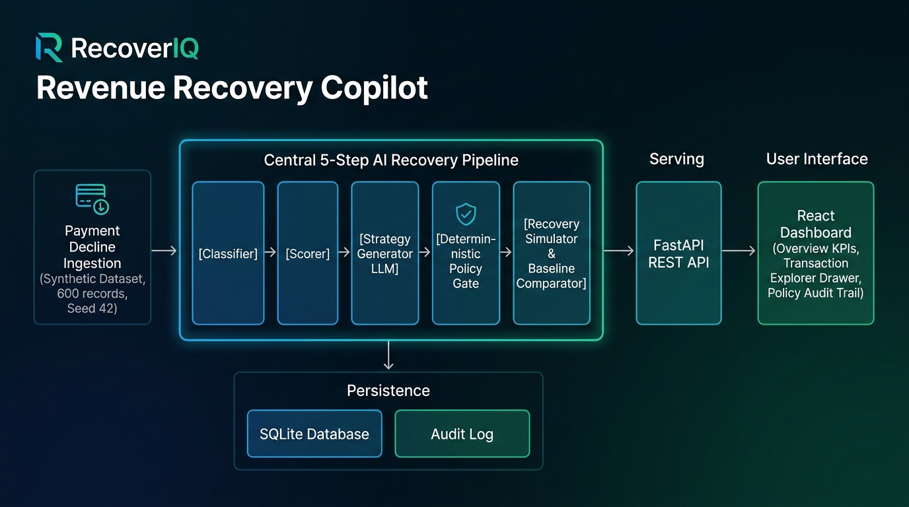

# RecoverIQ — Risk-Adjusted Revenue Recovery Copilot
> **Razorpay AI Buildathon 2026 — Track 03: AI Revenue Recovery**

> **One-Line Pitch:** RecoverIQ transforms blind, generic payment retries into intelligent, risk-adjusted recovery playbooks backed by a deterministic safety policy gate that maximizes recovered revenue while preventing cardholder churn and chargeback risks.

---

## 1. Problem & Why It Matters

Every year, digital businesses lose up to **10%–15% of annual recurring revenue (ARR)** to involuntary payment churn caused by failed transactions (insufficient funds, expired credentials, transient switch drops, and issuer policy declines).

Legacy recovery engines treat every payment failure identically:
- **Blind, Unstratified Retries:** Fixed rules (e.g., retry 3x across 3 consecutive days) execute regardless of *why* the transaction failed.
- **Card Network Penalties & Churn:** Retrying an expired card or incorrect CVV 3 times is guaranteed to fail, while retrying during an active fraud alert incurs severe network fees and risks merchant account suspension.
- **Lost Revenue:** High-value customers with temporary balance shortfalls are retried immediately before payday, failing prematurely and triggering unmerited churn.

Target Users: Merchant finance-ops, subscription management, and revenue-operations teams handling high-volume recurring billing and invoice collections.

---

## 2. Solution & User Journey

RecoverIQ introduces an end-to-end, 5-step AI recovery pipeline with deterministic policy guardrails:

```
+---------------------------------------------------------------------------------------------------------+
|                                    RECOVERIQ 5-STEP DECISION PIPELINE                                  |
|                                                                                                         |
|  [Step 1: Classifier]        -> Maps decline code + ambiguous gateway text to canonical root cause     |
|  [Step 2: Scorer]            -> Deterministic scoring (0.0-1.0) with mathematical factor decomposition  |
|  [Step 3: Strategy Gen]      -> Agentic LLM synthesizes context into recovery playbook proposal        |
|  [Step 4: Policy Gate]       -> Deterministic safety rules strictly validate, clamp, and override LLM   |
|  [Step 5: Sim & Comparator]  -> Head-to-head simulation vs Naive 3x baseline under fixed seed 42        |
+---------------------------------------------------------------------------------------------------------+
```

### User Journey
1. **Automated Ingestion:** Failed transactions from payment gateways are received via webhook or batch stream.
2. **Diagnostic Classification & Scoring:** The system categorizes the underlying root cause and computes a transparent 0.0–1.0 recoverability score.
3. **Agentic Strategy Proposal:** An LLM formulates a personalized recovery playbook (action, customer nudge channel, delay window, and retry count).
4. **Deterministic Policy Gate:** Hard-coded business safety rules review the LLM proposal, clamping or overriding dangerous actions (e.g., halting retries on fraud or enforce cooldowns).
5. **Simulated Benchmark & Execution:** The merchant evaluates head-to-head recovery performance against a naive baseline, monitoring net recovered revenue and false retries avoided.

---

## 3. Architecture Diagram & Description



RecoverIQ consists of four decoupled layers:
1. **Synthetic Data Engine (`data/sample/`):** Generates 600 realistic payment records with fixed seed `42` across customer tiers (`high_value`, `regular`, `new`) and gateways (`Razorpay`, `HDFC`, `ICICI`, `Axis`, `SBI`).
2. **AI & Decision Pipeline (`ai/`):** Five specialized modules (Classifier, Scorer, Strategy Generator, Policy Gate, Simulator).
3. **High-Performance Backend (`backend/`):** FastAPI with SQLite in WAL mode, structured Pydantic schemas, and persistent audit logging.
4. **Interactive Dashboard (`frontend/`):** React 18 + Vite + Tailwind CSS dashboard with KPI metrics, comparison visualizations, transaction explorer drawer, and policy governance trail.

---

## 4. Why This AI / Agent Design Was Chosen

- **Separation of Reasoning and Execution:** LLMs are exceptional at synthesizing messy unstructured text (such as conflicting bank error codes) and recommending tailored recovery strategies. However, **financial execution requires mathematical certainty**.
- **Deterministic Circuit Breakers:** LLMs must never be given unconstrained authority to initiate financial retries. RecoverIQ isolates the LLM inside a proposing role (Step 3), while hard-coded Python logic enforces non-negotiable safety guardrails (Step 4).
- **Inspectability Over Black-Box Models:** Both the recoverability score and policy overrides expose inspectable mathematical weights and logged violation reasons, enabling compliance teams to audit every recommendation.

---

## 5. Tools, APIs & Data Flow

| Component | Technology | Role |
| :--- | :--- | :--- |
| **Backend API** | FastAPI, Uvicorn, Python 3.11/3.13 | REST endpoints for seeding, analysis, simulation, and audit |
| **Persistence** | SQLite via SQLAlchemy | ACID storage for transactions, audit entries, and benchmark KPIs |
| **LLM Interface** | Pluggable `BaseLLMClient` | Pluggable client (OpenAI or deterministic mock LLM fallback) |
| **Frontend** | React 18, Vite, TypeScript, Tailwind CSS | Modern responsive dashboard with live KPIs and trace inspection |
| **Testing** | pytest, httpx TestClient | Unit and integration tests with heavy focus on safety rules |

### Data Flow
`Gateway Decline Event` → `Classifier` → `Scorer` → `Strategy Generator` → `Policy Gate (Validates/Overrides)` → `Audit Log Table` → `Simulator & Comparator` → `REST API` → `React Dashboard`.

---

## 6. Guardrails & Deterministic Validation

RecoverIQ enforces 4 non-negotiable safety rules inside the **Policy Gate (`ai/policy_gate.py`)**:

1. **`RULE_FRAUD_ZERO_TOLERANCE`:** If `fraud_flag == True` or decline code is `SUSPECTED_FRAUD`, automated retries are strictly blocked (`action = escalate_human`, `max_retries = 0`).
2. **`RULE_MAX_RETRIES_CAP`:** Strict cumulative cap of 3 retries per transaction lifetime. If previous attempts + proposed retries exceed 3, retries are clamped or stopped.
3. **`RULE_MIN_COOLDOWN_12H`:** Scheduled retries must have `retry_delay_hours >= 12` to prevent rapid repeat failures before funds can clear.
4. **`RULE_CUSTOMER_DAILY_LIMIT`:** Maximum 2 automated retry actions per customer per 24 hours to prevent card exhaustion and gateway rate-limiting.

Every intervention is logged in the `audit_logs` table with original proposal, rule name, and final decision.

---

## 7. How to Run Locally

### Prerequisites

- Python 3.11 or newer
- Node.js 18 or newer and npm
- A virtual environment is recommended for Python dependencies

Install the backend dependencies from the repository root:

```bash
python -m venv .venv
# Windows PowerShell
.venv\Scripts\Activate.ps1
# macOS/Linux
source .venv/bin/activate
pip install -r requirements.txt
```

### Direct Single Command (Launches Full-Stack App + Browser)
You can run the entire application (both the FastAPI backend and React frontend dashboard) with a single command:

```bash
python run.py
```
*(On Windows, you can also simply run `.\run.bat` or double-click `run.bat`)*

Before using the single-command runner for the first time, install the frontend dependencies and create the production bundle:

```bash
cd frontend
npm install
npm run build
cd ..
```

The runner will then:
1. Initialize the SQLite database and seed 600 records with fixed seed `42`.
2. Run the baseline and AI recovery simulations.
3. Automatically launch your default browser to `http://127.0.0.1:8000`.
4. Serve the compiled React dashboard and all REST API endpoints from FastAPI.

---

### Alternative: Run Backend & Frontend in Development Mode (2 Terminals)

**Terminal 1 (FastAPI Backend):**
```bash
uvicorn backend.main:app --host 127.0.0.1 --port 8000 --reload
```

**Terminal 2 (React Vite Frontend with Hot Reload):**
```bash
cd frontend
npm install
npm run dev
```
Open `http://localhost:5173`.

The Vite development server proxies API requests to the backend where configured. Keep both terminals running during development.

---

## 8. Demo & Seed Data Instructions

1. **Open the Web Dashboard:** Navigate to `http://localhost:5173`.
2. **Re-Seed Synthetic Data:** Click the **"Seed Data"** button in the navigation header to load the 600 synthetic records with seed `42`.
3. **Run Batch Simulation:** Click **"Run Batch Simulation"** on the Overview page. Watch the live KPI cards update with real head-to-head metrics against the naive baseline.
4. **Inspect Transaction Traces:** Navigate to the **"Transactions"** tab. Click on any transaction (e.g. `tx_edge_fraud_001` or `tx_edge_exp_backup_002`) to open the slide-over drawer and trace all 5 pipeline steps.
5. **Inspect Audit Log:** Navigate to the **"Policy Audit Log"** tab and filter by `OVERRIDDEN` to view how deterministic rules prevented unsafe LLM proposals.

---

## 9. Evaluation Metrics & Results

Head-to-head simulation run on the complete 600 synthetic transactions dataset with deterministic seed `42`:

| Metric | RecoverIQ Copilot | Naive 3x Baseline | Delta / Uplift |
| :--- | :--- | :--- | :--- |
| **Total Transactions Tested** | 600 | 600 | Identical dataset |
| **Total Amount at Risk** | ₹93,74,411.47 | ₹93,74,411.47 | -- |
| **Amount Recovered (₹)** | **₹63,28,661.14** | ₹49,45,689.67 | **+₹13,82,971.47 (+28.0% relative)** |
| **Revenue Recovery Rate (%)** | **67.51%** | 52.76% | **+14.75% Uplift** |
| **False Retries Avoided** | **1,088 retries** | 0 (blind retries fired) | **1,088 wasted retries eliminated** |
| **Policy Overrides Enforced** | **112 interventions** | 0 (no guardrails) | **100% compliance** |
| **Fraud Retries Prevented** | **31 / 31 (100%)** | 0 (retried blindly) | **Zero fraud retries allowed** |

---

## 10. Known Limitations

1. **Synthetic Simulation Model:** Success probabilities are modeled based on historical fintech recovery patterns rather than production gateway callback streams.
2. **Channel Dispatch:** WhatsApp, SMS, and Email channels are logged and simulated; production deployment requires webhooks to messaging providers (e.g. Gupshup, Twilio).
3. **Static Rule Thresholds:** The 12-hour cooldown and 3-retry cap are fixed constants; future iterations can tune these dynamically per issuer bank.

---

## 11. What Broke and How It Was Fixed

See [`docs/demo-notes.md`](docs/demo-notes.md) for full details:
1. **Windows Terminal Multi-Byte Character Map Crash:** Fixed currency formatting in CLI scripts to use `INR` for terminal stdout while preserving `₹` in the browser UI.
2. **Pydantic V2 Deprecation Warnings:** Modernized all schemas with `model_config = {"from_attributes": True}`.
3. **Python 3.13 Datetime UTC Deprecation:** Migrated all timestamp generators from `utcnow()` to `datetime.now(timezone.utc)`.
4. **Seeded Edge Cases Handled:**
   - *Fraud Camouflage (`tx_edge_fraud_001`):* Policy Gate intercepted deceptive decline message and stopped retry.
   - *Expired Card with Backup Mandate (`tx_edge_exp_backup_002`):* AI Copilot dispatched WhatsApp 1-click fallback, recovering ₹48,000 without burning blind retries.

---

## 12. Future Improvements

1. **Reinforcement Learning from Human Feedback (RLHF):** Fine-tune recovery strategy suggestions using merchant dispute resolution feedback.
2. **Dynamic Banking Switch Routing:** Automatically route scheduled retries through alternate acquirer banks with higher real-time success rates.
3. **One-Click UPI Mandate Migration:** Integrate Razorpay Mandate HQ APIs to automatically offer instant UPI Autopay swap when cards expire.

---

## 13. Test Suite

Run the full automated test suite (24 tests covering Policy Gate, edge cases, determinism, and API endpoints):
```bash
python -m pytest tests/
```
Output:
```
tests/test_classifier.py ...                                             [ 17%]
tests/test_edge_cases.py ..                                              [ 29%]
tests/test_policy_gate.py ........                                       [ 76%]
tests/test_scorer.py ...                                                 [ 94%]
tests/test_simulator.py .                                                [100%]
tests/test_api.py .......                                                [100%]
======================== 24 passed in 2.70s ========================
```

---

## 14. License
MIT License. Copyright (c) 2026 RecoverIQ Contributors (Razorpay AI Buildathon 2026).
