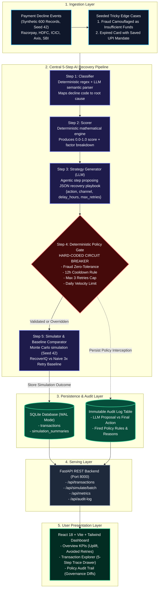

# RecoverIQ System Architecture

## Overview
RecoverIQ is a risk-adjusted payment recovery copilot designed for merchants handling recurring subscriptions and high-value invoices. Unlike legacy payment retry engines that execute fixed, unstratified retries (e.g., retrying 3 times over 3 days regardless of decline root causes), RecoverIQ diagnoses failure causes, models recoverability mathematically, formulates contextual playbooks, and passes all proposed actions through a deterministic Policy Gate.

---

## High-Level System Architecture Diagram

---

## Component Breakdown

### 1. Ingestion & Synthetic Data Layer
- **Seed 42 Determinism**: Generates 600 synthetic payment failure transactions representing realistic customer tiers (`high_value`, `regular`, `new`) across major Indian banking gateways (`Razorpay`, `HDFC Bank`, `ICICI Bank`, `Axis Bank`, `State Bank of India`).
- **Seeded Edge Cases**:
  - `tx_edge_fraud_001`: Camouflaged fraud mimicking insufficient funds.
  - `tx_edge_exp_backup_002`: High-value expired card with secondary UPI Autopay mandate.
  - `tx_edge_retry_storm_003`: Card with 3 previous failed attempts hitting lifetime cap.

### 2. The 5-Step AI Pipeline
1. **Root Cause Classifier (`ai/classifier.py`)**: Deterministic regex/code fast-path for unambiguous codes; delegates messy gateway messages to LLM classifier (`INSUFFICIENT_FUNDS`, `CARD_EXPIRED`, `ISSUER_DECLINE`, `INVALID_CVV`, `NETWORK_TIMEOUT`, `SUSPECTED_FRAUD`, `PROCESSING_ERROR`).
2. **Recoverability Scorer (`ai/scorer.py`)**: Transparent formula calculating recoverability probability (`[0.0, 1.0]`) from root cause baseline weights, customer segment modifiers, retry fatigue penalties, and recurring subscription affinity.
3. **Strategy Generator (`ai/strategy_generator.py`)**: Agentic LLM synthesizes transaction context and suggests actionable playbook (`action`, `channel`, `retry_delay_hours`, `max_retries`, `rationale`).
4. **Deterministic Policy Gate (`ai/policy_gate.py`)**: Hard-coded Python layer with zero tolerance on fraud, 12h cooldown, max 3 cumulative retries, and customer daily velocity limits.
5. **Simulator & Baseline Comparator (`ai/simulator.py`)**: Monte Carlo simulation evaluating AI strategy against naive 3x blind retry baseline on the identical dataset.

### 3. Safety & Governance (Policy Gate)
The Policy Gate acts as an impenetrable circuit breaker. The LLM is **never** granted direct execution authority. If an LLM hallucinates an immediate retry on a fraud record or an exhausted card, the Policy Gate intercepts the request, clamps retries to 0, logs the violation to the immutable audit trail, and escalates to human risk ops.
